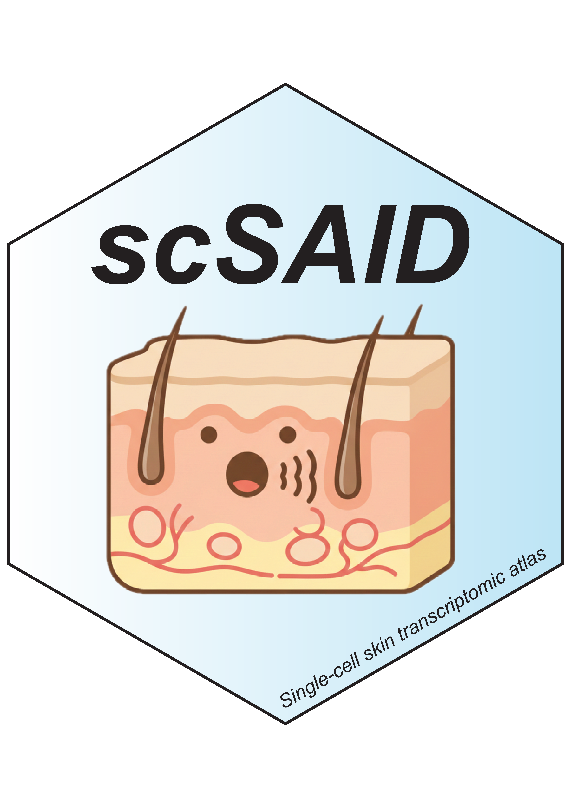

# scSAID: <u>S</u>ingle-<u>C</u>ell <u>S</u>kin & <u>A</u>ppendages <u>I</u>ntegrated <u>D</u>atabase 

https://skin-scsaid.com/

[](https://github.com/Dostoyevsky7/SkinDB_web/actions/workflows/deploy.yml)

> A comprehensive web platform for exploring single-cell RNA sequencing data from skin and appendage tissues.

> The database contains data from over **1,000,000 cells** across **600+ samples** from human and mouse skin tissues in both healthy and disease conditions.


## Features

-   **Browse** — Explore datasets with filtering and pagination
-   **Search & Integrate** — Select multiple datasets for integrated UMAP visualization
-   **Dataset Details** — View sample metadata, cell clustering, DEG results, and CellPhoneDB analysis
-   **Data Export** — Download filtered results as Excel files

## Tech Stack

| Layer    | Technology                |
|----------|---------------------------|
| Frontend | JSP, CSS3, JavaScript     |
| Backend  | Java Servlets             |
| Build    | Maven                     |
| Server   | Apache Tomcat 9           |
| Data     | Apache POI, Python (Dash) |

## Quick Start

``` bash
# Clone the repository
git clone https://github.com/Dostoyevsky7/SkinDB_web.git
cd SkinDB_web

# Make Maven wrapper executable
chmod +x mvnw

# Run locally
./mvnw tomcat7:run
```

Open [**http://localhost:8080**](http://localhost:8080){.uri} in your browser.

## Project Structure

```         
src/main/
├── java/
│   ├── Servlet/        # Request handlers
│   ├── Utils/          # Data processing utilities
│   └── Entity/         # Data models
├── webapp/
│   ├── CSS/            # Stylesheets
│   ├── images/         # Static assets
│   ├── WEB-INF/        # Config & data files
│   └── *.jsp           # Page templates
└── resources/
    └── mapping.json    # Field mappings
```

## Requirements

-   Java 11+
-   Maven 3.6+

## Production Deployment Notes (Enrichment & Gene Scoring)

The enrichment and gene set scoring sections in `details.jsp` are embedded via iframes that expect
same-origin paths:

-   `/enrichment/` (Dash app on localhost:8051)
-   `/gene-scoring/` (Dash app on localhost:8052)

To make these work on `https://skin-scsaid.com`, configure your HTTPS reverse proxy (nginx) to
forward these paths to the local Dash services. Example nginx blocks:

```nginx
map $http_upgrade $connection_upgrade {
    default upgrade;
    ''      close;
}

location /enrichment/ {
    proxy_pass http://127.0.0.1:8051/enrichment/;
    proxy_http_version 1.1;
    proxy_set_header Host $host;
    proxy_set_header X-Real-IP $remote_addr;
    proxy_set_header X-Forwarded-For $proxy_add_x_forwarded_for;
    proxy_set_header X-Forwarded-Proto $scheme;
    proxy_set_header Upgrade $http_upgrade;
    proxy_set_header Connection $connection_upgrade;
    proxy_redirect off;
}

location /gene-scoring/ {
    proxy_pass http://127.0.0.1:8052/gene-scoring/;
    proxy_http_version 1.1;
    proxy_set_header Host $host;
    proxy_set_header X-Real-IP $remote_addr;
    proxy_set_header X-Forwarded-For $proxy_add_x_forwarded_for;
    proxy_set_header X-Forwarded-Proto $scheme;
    proxy_set_header Upgrade $http_upgrade;
    proxy_set_header Connection $connection_upgrade;
    proxy_redirect off;
}
```

Ensure both Dash apps are running on the server and kept alive with a process manager (systemd,
supervisor, pm2, etc.).

## License

Zhejiang University · ZJE ()

------------------------------------------------------------------------

<p align="center">

<sub>Built for skin biology research</sub>

</p>
